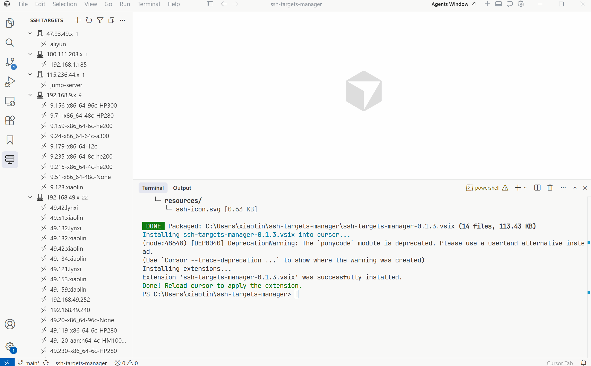

# SSH Targets Manager

Manage SSH hosts from your local SSH config directly in VS Code or Cursor.

SSH Targets Manager gives you a focused sidebar for browsing, searching, grouping, and opening remote SSH targets. It keeps your existing `~/.ssh/config` as the source of truth while adding the small workflow improvements that make daily remote development faster: favorites, subnet groups, remembered folders, context actions, and one-click connections.

## Preview




## Highlights

- Browse hosts from `~/.ssh/config` and optional additional SSH config files.
- Search by host alias, hostname, user, or remembered remote folder.
- Group hosts automatically by IP subnet, or define your own regex-based groups.
- Pin frequently used hosts in a Favorites section.
- Remember recently opened remote folders per host.
- Connect in the current window, a new window, or an integrated terminal.
- Add new SSH hosts from a simple form.
- Copy hostnames and SSH commands from the context menu.

## Why Use It

If you regularly switch between many remote machines, your SSH config can become hard to scan. SSH Targets Manager turns that config into a compact dashboard inside the editor, so you can find the right host, jump back into a known folder, and start a remote session without manually typing aliases or commands.

It is designed to complement the standard SSH workflow instead of replacing it. Your SSH configuration remains portable, editable, and compatible with the tools you already use.

## Usage

1. Install the extension.
2. Open the `SSH Targets` activity bar view.
3. The extension reads hosts from your default SSH config at `~/.ssh/config`.
4. Use the toolbar filter to search hosts.
5. Right-click a host to connect, open a terminal, copy connection details, add it to Favorites, or manage remembered folders.

## Configuration

This extension contributes the following settings:

- `sshTargetsManager.sshConfigPaths`: additional SSH config file paths to read.
- `sshTargetsManager.customGroups`: custom group rules where each key is a display name and each value is a regex matched against host aliases or hostnames.
- `sshTargetsManager.autoGroupBySubnet`: automatically group hosts by IP subnet when no custom groups are configured.

Example custom groups:

```json
{
  "Beijing": "192\\.168\\.9\\..*",
  "Wuhan": "192\\.168\\.49\\..*"
}
```

## Shared storage

Since **0.1.6**, the list of "remembered remote folders" (the folders that appear under each host in the sidebar) is stored in a single JSON file shared by every editor that has this extension installed:

- **Location:** `~/.ssh/.ssh-targets-folders.json` (Linux/macOS) or `%USERPROFILE%\.ssh\.ssh-targets-folders.json` (Windows).
- **File mode:** `0600` (matches the rest of `~/.ssh`).
- **Format:** `{ "version": 1, "folders": [{ "host", "folder", "lastUsed" }, ...] }`, sorted by `lastUsed` descending.
- **Dedup key:** `(host, folder)` (case-insensitive), so the same folder added in Cursor and again in Trae only appears once.

### How the migration works

Before 0.1.6, remembered folders were stored in each editor's own private `globalState` (`sshTargets.recentFolders`). Starting with 0.1.6:

1. On the first activation in each editor, the extension reads that editor's old `globalState`, merges the entries into the shared file (with dedup), and clears the legacy key in that editor's `globalState`. The migration runs once per editor and is idempotent.
2. The shared file is the source of truth from that point on. Reads and writes are atomic (tmp file + rename) and serialized within the extension.
3. A one-time notification appears the first time an editor migrates data, with a button to open the file directly.

In practice this means:

- If you currently use this extension in both Cursor and Trae, simply open **each editor at least once** with 0.1.6 installed. Both editors' history will end up in the shared file, and any folder added or removed in one editor will be visible in the other after a reload.
- The host list itself still comes from `~/.ssh/config` and is **not** affected by this change.

### Edge cases the extension handles

- `~/.ssh/` does not exist → created on first write.
- Shared file missing, empty, or not valid JSON → treated as "no data"; a corrupted file is backed up as `…corrupted-<timestamp>` and a fresh store is used.
- Schema version mismatch → logged, existing entries are still loaded.
- Read or write permission denied → logged, the in-memory store keeps working and a future flush is retried.
- Concurrent writes from multiple editor instances → atomic rename + write queue per instance.

You can open the shared file at any time with the command **SSH Targets: Show Shared Storage Location** from the command palette.

## Requirements

- VS Code `1.85.0` or newer.
- A local SSH configuration file, usually `~/.ssh/config`.
- Remote connection actions work best with the VS Code Remote - SSH extension installed.

## Development

Install dependencies and compile:

```powershell
npm install
npm run compile
```

Package the extension:

```powershell
npm run package
```

Build and copy the compiled output into an installed extension directory:

```powershell
.\build.ps1
```

## Release Notes

### 0.1.6

- Remembered remote folders now live in a single shared file at `~/.ssh/.ssh-targets-folders.json`, so Cursor, Trae, and VS Code all see the same list. Existing per-editor history is migrated automatically on first activation in each editor; the migration is one-shot and idempotent.
- The shared file is written atomically (tmp + rename) with file mode `0600`, and corrupted copies are backed up instead of dropped.
- New command `SSH Targets: Show Shared Storage Location` opens the shared file directly.

### 0.1.4

- Replaced the preview screenshot with an animated GIF.
- Improved the local build script to package and install the extension into the current editor.
- Improved Marketplace documentation and publishing metadata.
- Added SSH target browsing, filtering, grouping, favorites, remembered folders, and connection actions.
