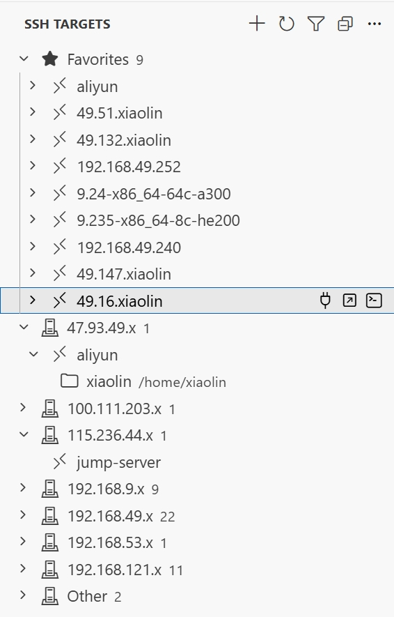

# SSH Targets Manager

Manage SSH hosts from your local SSH config directly in VS Code or Cursor.

SSH Targets Manager gives you a focused sidebar for browsing, searching, grouping, and opening remote SSH targets. It keeps your existing `~/.ssh/config` as the source of truth while adding the small workflow improvements that make daily remote development faster: favorites, subnet groups, remembered folders, context actions, and one-click connections.

## Preview

<!-- Replace these placeholders after adding screenshots to the repository. Suggested path: images/preview.png -->



<!-- Optional: add a short GIF showing search -> favorite -> connect. Suggested path: images/demo.gif -->

<!--  -->

## Highlights

- Browse hosts from `~/.ssh/config` and optional additional SSH config files.
- Search by host alias, hostname, user, or remembered remote folder.
- Group hosts automatically by IP subnet, or define your own regex-based groups.
- Pin frequently used hosts in a Favorites section.
- Remember recently opened remote folders per host.
- Connect in the current window, a new window, or an integrated terminal.
- Add new SSH hosts from a simple form.
- Copy hostnames and SSH commands from the context menu.

## Why Use It

If you regularly switch between many remote machines, your SSH config can become hard to scan. SSH Targets Manager turns that config into a compact dashboard inside the editor, so you can find the right host, jump back into a known folder, and start a remote session without manually typing aliases or commands.

It is designed to complement the standard SSH workflow instead of replacing it. Your SSH configuration remains portable, editable, and compatible with the tools you already use.

## Usage

1. Install the extension.
2. Open the `SSH Targets` activity bar view.
3. The extension reads hosts from your default SSH config at `~/.ssh/config`.
4. Use the toolbar filter to search hosts.
5. Right-click a host to connect, open a terminal, copy connection details, add it to Favorites, or manage remembered folders.

## Configuration

This extension contributes the following settings:

- `sshTargetsManager.sshConfigPaths`: additional SSH config file paths to read.
- `sshTargetsManager.customGroups`: custom group rules where each key is a display name and each value is a regex matched against host aliases or hostnames.
- `sshTargetsManager.autoGroupBySubnet`: automatically group hosts by IP subnet when no custom groups are configured.

Example custom groups:

```json
{
  "Beijing": "192\\.168\\.9\\..*",
  "Wuhan": "192\\.168\\.49\\..*"
}
```

## Requirements

- VS Code `1.85.0` or newer.
- A local SSH configuration file, usually `~/.ssh/config`.
- Remote connection actions work best with the VS Code Remote - SSH extension installed.

## Development

Install dependencies and compile:

```powershell
npm install
npm run compile
```

Package the extension:

```powershell
npm run package
```

Build and copy the compiled output into an installed extension directory:

```powershell
.\build.ps1
```

## Release Notes

### 0.1.3

- Improved Marketplace documentation and publishing metadata.
- Added SSH target browsing, filtering, grouping, favorites, remembered folders, and connection actions.
